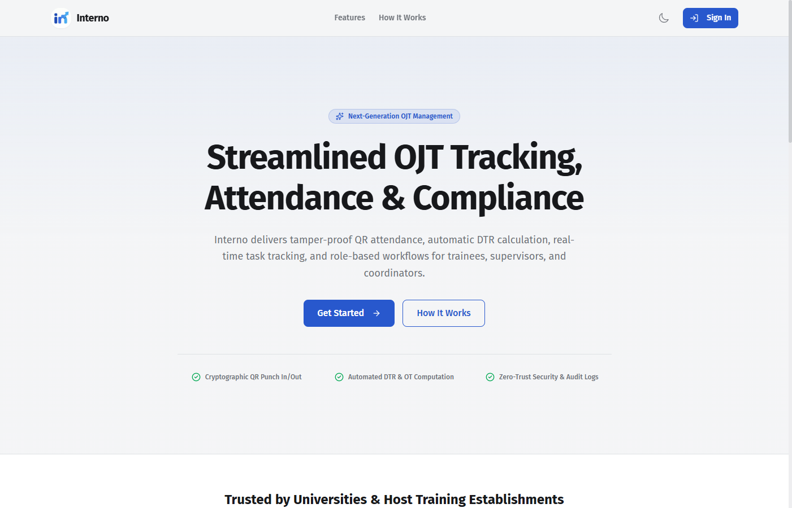
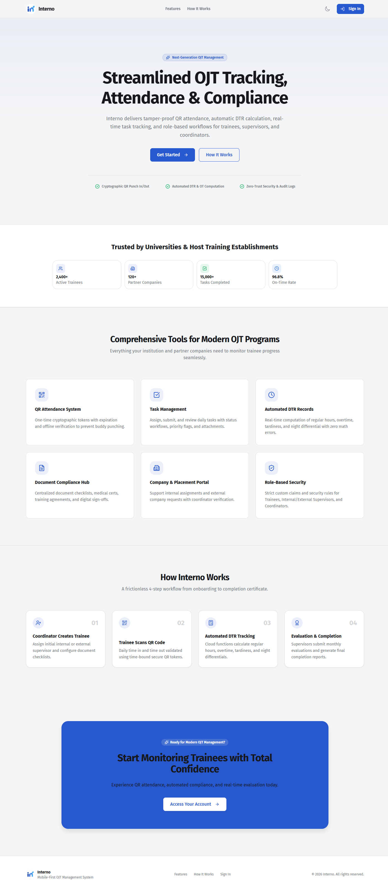
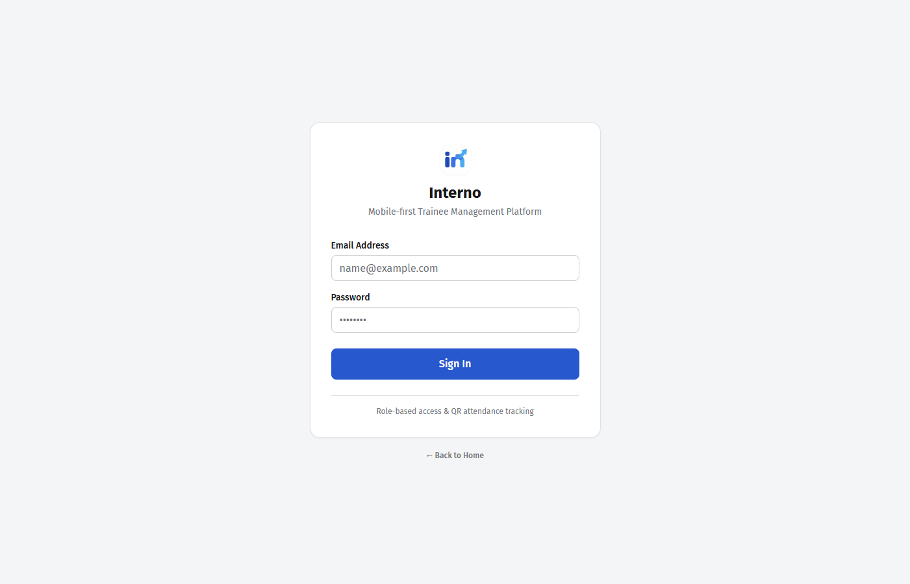
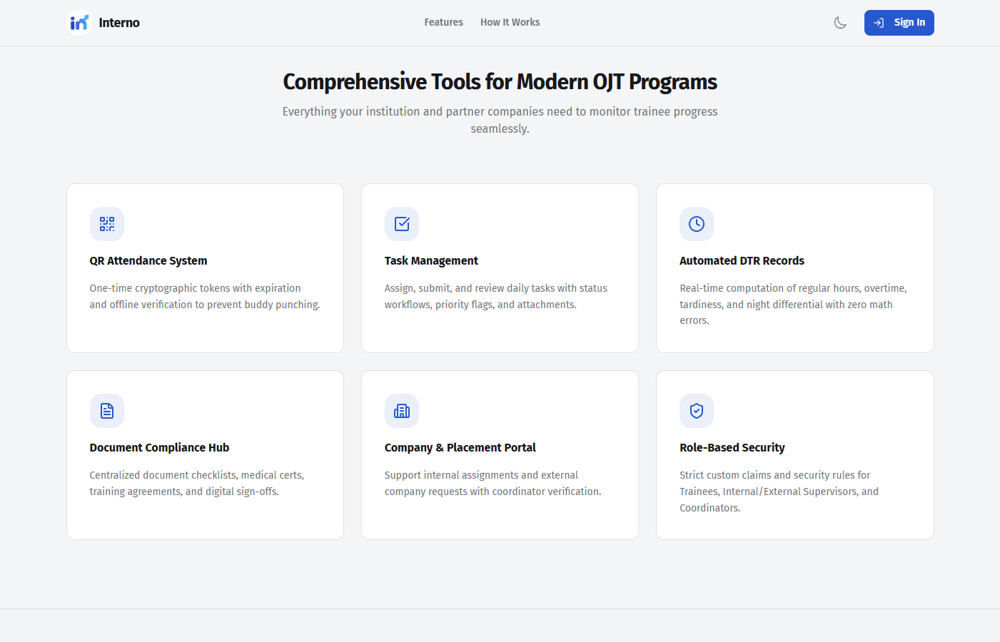
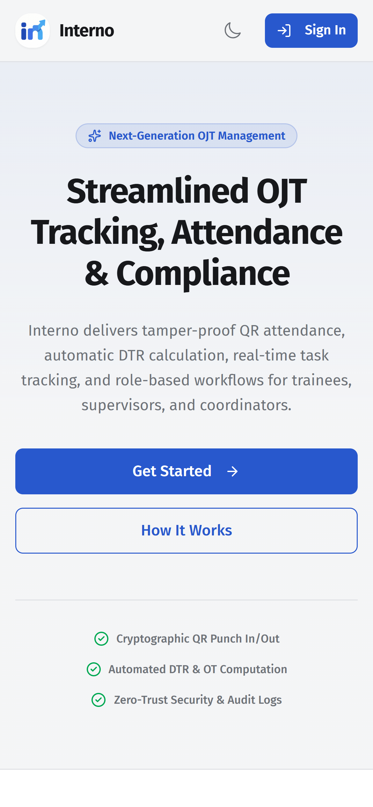

# Interno — Trainee Management System

**Interno** helps schools and companies manage student interns (OJTs) — from attendance and tasks to time records and documents — all in one mobile-friendly website.

## Table of Contents

- [What is Interno?](#what-is-interno)
- [Try the Demo](#try-the-demo)
- [Screenshots](#screenshots)
- [Who Uses Interno?](#who-uses-interno)
- [How It Works](#how-it-works)
- [Key Features in Plain Language](#key-features-in-plain-language)
- [Frequently Asked Questions](#frequently-asked-questions)
- [Need Help?](#need-help)

## What is Interno?

Interno replaces paper forms, group chats, and spreadsheets for managing On-the-Job Training (OJT).

Instead of signing a paper attendance sheet, interns **scan a QR code** on their phone to time in and out. Their work hours are **computed automatically**, tasks are assigned and checked online, and all required documents are uploaded in one place.

Everyone — interns, supervisors, school coordinators, and admins — sees only what they need to see.

## Try the Demo

**On your computer or phone browser:**

1. Go to: **https://interno-cec9f.web.app** (live site)
2. Click **Sign In**
3. Log in with the account given to you by your coordinator or admin

That's it. You will be taken straight to your own dashboard.

> No installation needed — Interno works in any modern web browser like Chrome, Edge, or Safari.

## Screenshots

### Homepage — full view

### Homepage — welcome section

This is the first screen you see. It explains what Interno does and has a **Get Started** button.

### Login page

Enter your email and password here to access your account.

### Features overview

A quick look at everything Interno can do — attendance, tasks, time records, documents, and more.

### Mobile view

Interno is designed **phone-first** for interns — big buttons, simple screens, easy scanning.

## Who Uses Interno?

| If you are... | You can... |
|---|---|
| **Intern / Trainee** | Scan QR to time in/out, view your tasks, check your hours, upload documents, request leave |
| **Supervisor** | Show the QR code, assign tasks, approve work hours and tasks, evaluate interns |
| **School Coordinator** | Assign interns to companies, approve company transfers, check attendance and documents |
| **Admin** | Manage users, companies, departments, and system settings |

## How It Works

**For interns — daily routine:**

1. **Coordinator creates your account** and assigns you to a company.
2. **You scan a QR code** every morning to time in, and every afternoon to time out.
3. **Your hours are tracked automatically** — no manual computation.
4. **You do your assigned tasks** and mark them as submitted.
5. **Your supervisor reviews and approves** your tasks and hours.
6. At the end of training, your **reports and evaluations** are ready.

**Moving to a different company:**

1. You request an **external placement** inside Interno.
2. Your coordinator **approves** the request.
3. You **choose a company** from the list.
4. The coordinator **verifies** the company and creates the new supervisor account.
5. You are now officially assigned to the new company.

## Key Features in Plain Language

- **QR Attendance** — A code shown by your supervisor expires in about a minute, so it can't be copied or cheated. One scan = one time-in or time-out.
- **Automatic Time Records (DTR)** — Your total hours, overtime, and late minutes are calculated for you. No math errors.
- **Correction Requests** — Forgot to time out? Just submit a request with the correct time and reason. Your supervisor approves it, and the original record is kept for honesty.
- **Task Management** — See what you need to do, submit your work, and get feedback. Overdue tasks are clearly marked.
- **Document Hub** — Upload requirements like your resume, medical certificate, or parent consent. Coordinators check them off.
- **Leave Requests** — File sick or emergency leave with a reason and attachment.
- **Evaluations** — Supervisors score your performance fairly and transparently.
- **Announcements** — Important updates from your school or company appear in-app.
- **Reports** — Download attendance and progress reports as PDF or Excel files.
- **Works on weak internet** — You can still view your tasks offline; everything syncs when you're back online.

## Frequently Asked Questions

**Do I need to install anything?**
No. Just open the website in your browser and sign in.

**What if I forget to time out?**
Don't worry. You'll get a reminder. Just file a correction request in the app and your supervisor will review it.

**Can I use Interno on my phone?**
Yes — that's how it's meant to be used. The intern screens are designed for one-handed phone use.

**What if I change companies?**
Request an external placement in the app. Your coordinator will guide you through approval and verification.

**Is my information safe?**
Yes. You only see your own records. Supervisors only see their assigned interns. All changes are logged with who did what and when.

**Who do I contact if I can't log in?**
Contact your school coordinator or company admin — they manage accounts.

## Need Help?

- **Users:** Contact your school coordinator or supervisor for account and training questions.
- **Support:** Email shawngenese25@gmail.com for help with accounts, access, or anything not working.

© 2026 Interno. All rights reserved.
